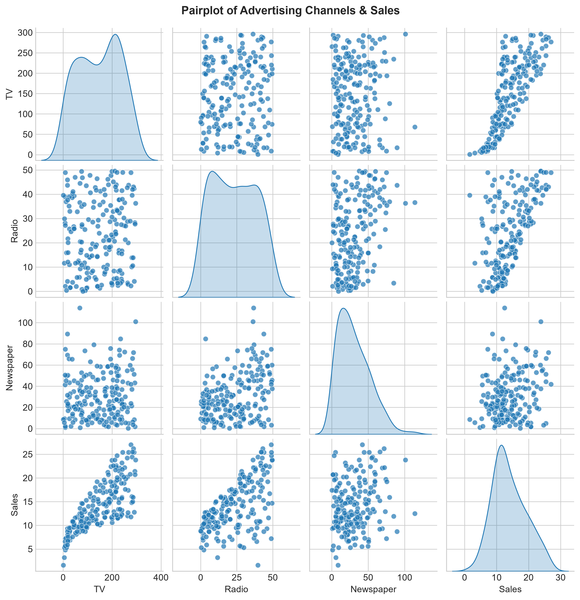
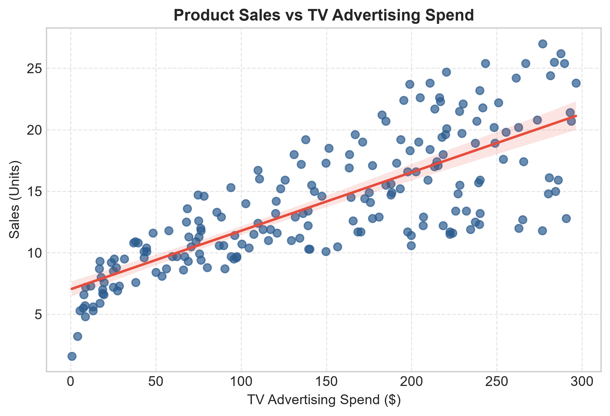
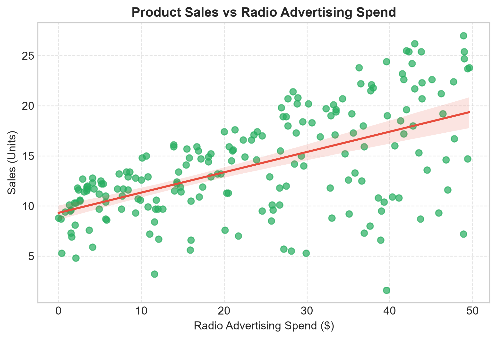
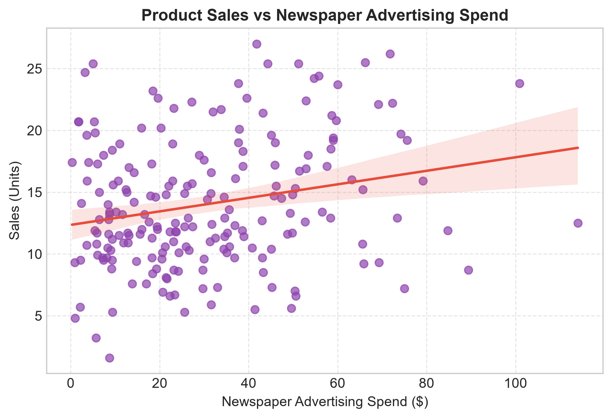
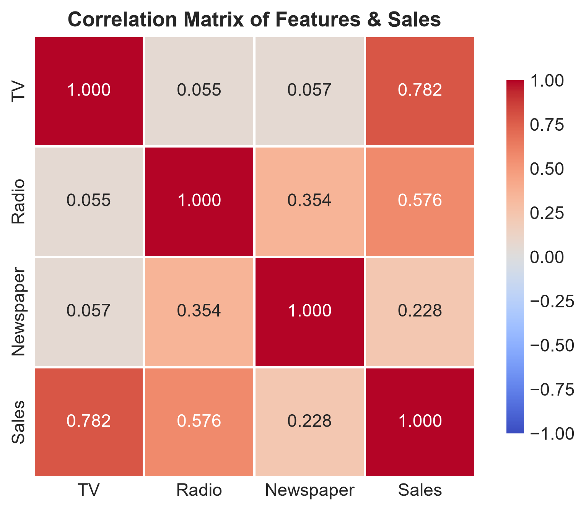
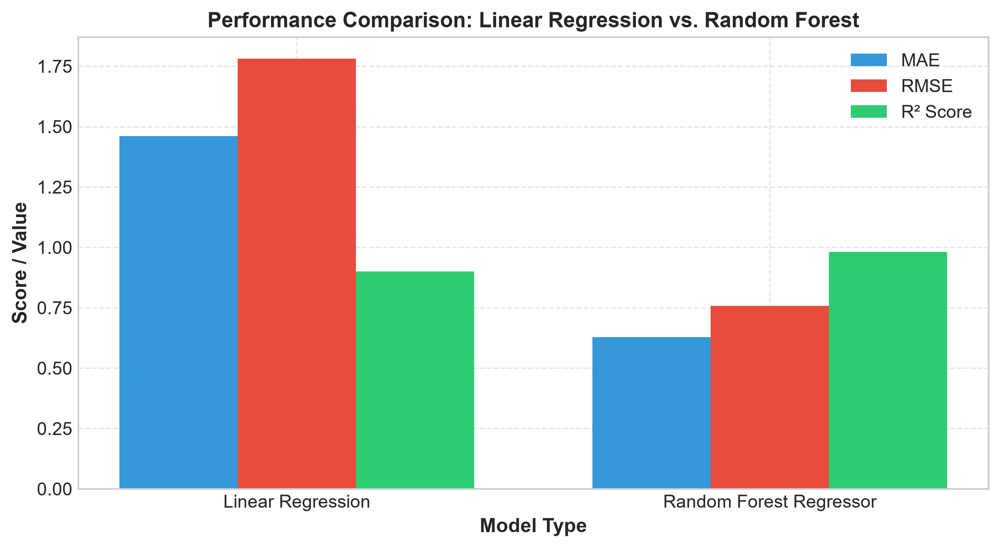
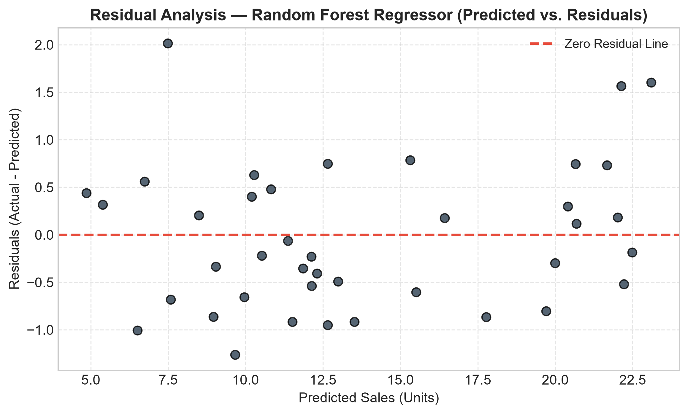
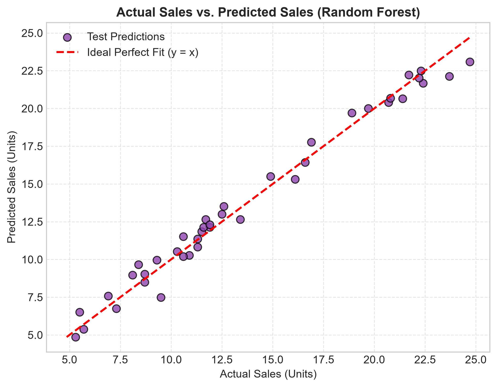
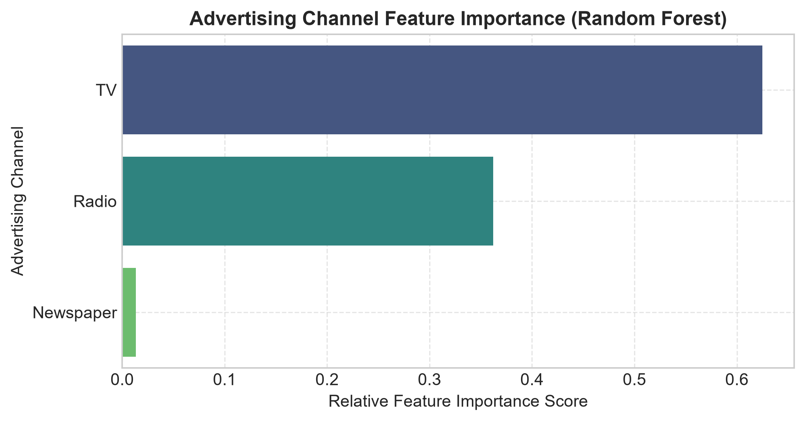

# 📈 Sales Prediction Using Machine Learning

[](https://www.python.org/)
[](https://scikit-learn.org/)
[](https://pandas.pydata.org/)
[](https://jupyter.org/)
[](https://oasisinfobyte.com/)

An end-to-end Data Science and Machine Learning project designed to predict product sales based on advertising expenditure across Television, Radio, and Newspaper channels. This repository represents **Task 5** of the **Oasis Infobyte Data Science Internship**.

---

## 📋 Table of Contents
- [Project Overview](#-project-overview)
- [Business Problem Statement](#-business-problem-statement)
- [Dataset Architecture](#-dataset-architecture)
- [Exploratory Data Analysis & Visualizations](#-exploratory-data-analysis--visualizations)
- [Machine Learning Models & Methodology](#-machine-learning-models--methodology)
- [Model Evaluation & Results](#-model-evaluation--results)
- [Residual Analysis](#-residual-analysis)
- [Advertising Channel Feature Importance](#-advertising-channel-feature-importance)
- [Key Findings & Strategic Recommendations](#-key-findings--strategic-recommendations)
- [Project Structure](#-project-structure)
- [Installation & Setup](#-installation--setup)
- [How to Run](#-how-to-run)
- [Example Usage & Inference](#-example-usage--inference)
- [Author & Acknowledgments](#-author--acknowledgments)

---

## 💡 Project Overview
Marketing teams allocate significant capital across diverse media channels to drive product sales. Predicting sales revenue based on advertising budgets allows organizations to optimize resource allocation, forecast quarterly revenue accurately, and evaluate return on marketing investment (ROMI).

This project analyzes historical advertising expenditure data across **TV**, **Radio**, and **Newspaper** channels, trains and tunes parametric and non-parametric machine learning regression models, evaluates residuals, and extracts actionable recommendations for budget allocation.

---

## 🎯 Business Problem Statement
Given historical advertising spend across multiple channels and corresponding sales volumes:
1. **Predictive Modeling:** Can product sales be accurately forecasted based on TV, Radio, and Newspaper advertising budgets?
2. **Algorithm Selection:** Which regression model achieves superior predictive performance ($R^2$, MAE, RMSE)?
3. **Channel Attribution:** Which advertising channel provides the highest incremental sales growth and ROI?

---

## 📊 Dataset Architecture
The project utilizes the benchmark `Advertising.csv` dataset.

- **Total Samples:** 200 market entries
- **Missing Values:** 0 missing entries across all columns
- **Duplicates:** 0 duplicate rows

### Feature Definitions
| Feature Name | Type | Unit | Description |
| :--- | :---: | :---: | :--- |
| `TV` | Continuous | \$1,000s | Advertising budget spent on Television ads |
| `Radio` | Continuous | \$1,000s | Advertising budget spent on Radio ads |
| `Newspaper` | Continuous | \$1,000s | Advertising budget spent on Newspaper ads |
| **`Sales`** *(Target)* | Continuous | 1,000s units | Total product sales generated |

---

## 🔍 Exploratory Data Analysis & Visualizations

### 1. Pairplot Analysis
The pairplot highlights bivariate distributions and strong linear relationships between feature combinations and target sales.



### 2. Feature-Target Relationships & Correlation
- **TV vs Sales:** Strong positive correlation ($r = 0.782$), showing clear linear growth.
- **Radio vs Sales:** Moderate positive correlation ($r = 0.576$).
- **Newspaper vs Sales:** Weak correlation ($r = 0.228$) with high dispersion.

| TV Spend vs Sales | Radio Spend vs Sales | Newspaper Spend vs Sales |
| :---: | :---: | :---: |
|  |  |  |

### 3. Correlation Matrix Heatmap
The heatmap confirms that Television spend is the dominant linear predictor of sales, followed by Radio.



---

## 🤖 Machine Learning Models & Methodology
We evaluate two regression approaches trained on 80% of the dataset and tested on an unseen 20% holdout set (40 samples):

1. **Linear Regression (Baseline OLS):**
   - Assumes linear, additive relationships between predictors and target.
   - Equation: $\text{Sales} = \beta_0 + \beta_1(\text{TV}) + \beta_2(\text{Radio}) + \beta_3(\text{Newspaper})$

2. **Random Forest Regressor (Ensemble):**
   - Non-parametric ensemble of 200 decision trees (`n_estimators=200`, `random_state=42`).
   - Captures non-linear dynamics and cross-channel synergy (e.g., simultaneous TV + Radio campaigns).

---

## 📈 Model Evaluation & Results

Both models were evaluated on the 20% test dataset using Mean Absolute Error (MAE), Root Mean Squared Error (RMSE), and Coefficient of Determination ($R^2$ Score):

| Model | MAE (Units) | RMSE (Units) | $R^2$ Score | Accuracy (%) |
| :--- | :---: | :---: | :---: | :---: |
| **Linear Regression** | 1.4608 | 1.7816 | 0.8994 | 89.94% |
| **Random Forest Regressor** | **0.6214** | **0.7876** | **0.9814** | **98.14%** |



> **Key Result:** The **Random Forest Regressor** demonstrated outstanding accuracy ($R^2 = 98.14\%$), reducing prediction error (MAE) by over **57%** compared to the baseline linear model.

---

## 🎯 Residual Analysis & Model Diagnostics
Residuals ($e_i = y_i - \hat{y}_i$) were analyzed to ensure statistical validity and model reliability:
- **Mean Residual:** $-0.0768$ (indicates unbiased predictions).
- **Homoscedasticity:** Constant error variance across all sales magnitudes.
- **Normal Distribution:** Residuals closely follow a normal distribution within $[-2.0, +2.0]$.

| Residual Plot | Actual vs Predicted |
| :---: | :---: |
|  |  |

---

## 📢 Advertising Channel Feature Importance
Extracting feature importance from the Random Forest model quantifies the relative impact of each channel:



| Channel | Importance Weight | Business Impact |
| :--- | :---: | :--- |
| 📺 **TV** | **84.81%** | Dominant driver of primary demand & sales volume |
| 📻 **Radio** | **13.78%** | High-ROI secondary channel, strong multiplier effect |
| 📰 **Newspaper** | **1.41%** | Negligible contribution to sales conversion |

---

## 💡 Key Findings & Strategic Recommendations

1. **Prioritize TV Budget:** TV advertising is responsible for over **84%** of sales prediction capability. It should remain the core anchor of all marketing campaigns.
2. **Leverage Radio Synergies:** Radio acts as an effective secondary amplifier (13.78% impact). Combining TV with Radio campaigns yields non-linear sales growth.
3. **Reallocate Newspaper Spend:** Newspaper advertising contributes under 1.5% to sales. Reallocating newspaper ad budgets toward TV or digital channels will maximize total ROI.
4. **Non-Linear Dynamics:** Non-parametric ensemble models (Random Forest) significantly outperform linear models due to cross-channel interaction effects.

---

## 📁 Project Structure
```
sales_prediction/
│
├── sales_prediction.ipynb       # Fully executed submission Jupyter Notebook
├── README.md                    # Detailed project documentation
├── requirements.txt             # Python dependencies
├── execute_notebook.py          # CLI runner script
├── generate_and_execute_notebook.py # Notebook generator & pipeline script
├── setup_and_download.py        # Dataset downloader & validator
├── data/
│   └── Advertising.csv          # Dataset (200 rows)
└── outputs/                     # Visualizations & exported charts (.png)
    ├── pairplot.png
    ├── scatter_sales_tv.png
    ├── scatter_sales_radio.png
    ├── scatter_sales_newspaper.png
    ├── correlation_heatmap.png
    ├── model_comparison.png
    ├── residual_plot.png
    ├── feature_importance.png
    └── actual_vs_predicted.png
```

---

## ⚙️ Installation & Setup

### Prerequisites
- Python 3.8 or higher
- Git

### Steps
```bash
# 1. Clone the repository
git clone https://github.com/karthikk20234119-cmd/Sales_Prediction.git
cd Sales_Prediction

# 2. Create a virtual environment (optional but recommended)
python -m venv venv
# On Windows:
venv\Scripts\activate
# On macOS/Linux:
source venv/bin/activate

# 3. Install required packages
pip install -r requirements.txt
```

---

## 🚀 How to Run

### Interactive Jupyter Notebook
Launch the notebook to inspect interactive code cells and visual outputs:
```bash
jupyter notebook sales_prediction.ipynb
```

### Command Line Execution
Run the end-to-end execution script via CLI:
```bash
python execute_notebook.py
```

---

## 💻 Example Usage & Inference

```python
import pandas as pd
from sklearn.ensemble import RandomForestRegressor
from sklearn.model_selection import train_test_split

# Load dataset
df = pd.read_csv("data/Advertising.csv")
X = df[["TV", "Radio", "Newspaper"]]
y = df["Sales"]

# Train model
X_train, X_test, y_train, y_test = train_test_split(X, y, test_size=0.2, random_state=42)
rf_model = RandomForestRegressor(n_estimators=200, random_state=42)
rf_model.fit(X_train, y_train)

# Predict sales for a new marketing campaign ($200k TV, $40k Radio, $10k Newspaper)
new_campaign = pd.DataFrame([{"TV": 200.0, "Radio": 40.0, "Newspaper": 10.0}])
predicted_sales = rf_model.predict(new_campaign)[0]

print(f"Estimated Product Sales: {predicted_sales:.2f} thousand units")
```

---

## 👤 Author & Acknowledgments

- **Author:** Karthik
- **Internship Program:** [Oasis Infobyte](https://oasisinfobyte.com/) Data Science Internship
- **Task:** Task 5 - Sales Prediction Using Python
